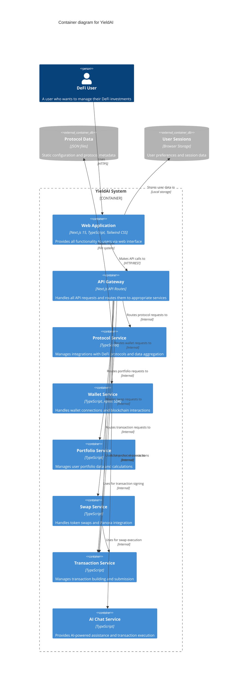

# C4 Container Diagram - YieldAI System

## Container Architecture

This diagram shows the high-level technical building blocks that make up the YieldAI system.

## Container Details

### Web Application
- **Technology**: Next.js 15, TypeScript, Tailwind CSS, shadcn/ui
- **Responsibilities**:
  - User interface and experience
  - Component rendering and state management
  - Real-time data updates
  - Mobile responsiveness
  - Drag & drop functionality

### API Gateway
- **Technology**: Next.js API Routes
- **Responsibilities**:
  - Request routing and validation
  - Authentication and authorization
  - Rate limiting and security
  - Response formatting
  - Error handling

### Protocol Service
- **Technology**: TypeScript
- **Responsibilities**:
  - DeFi protocol integrations
  - Data aggregation from multiple sources
  - Protocol-specific data transformation
  - Investment opportunity discovery
  - Real-time APY calculations

### Wallet Service
- **Technology**: TypeScript, Aptos SDK
- **Responsibilities**:
  - Wallet connection management
  - Account balance retrieval
  - Transaction signing coordination
  - Multi-wallet support (Petra, Martian, etc.)
  - Gas station integration

### Portfolio Service
- **Technology**: TypeScript
- **Responsibilities**:
  - Portfolio data aggregation
  - Token balance calculations
  - USD value conversions
  - Position tracking across protocols
  - Performance metrics

### Swap Service
- **Technology**: TypeScript
- **Responsibilities**:
  - Panora API integration
  - Token swap execution
  - Price discovery and routing
  - Swap quote generation
  - Liquidity pool management

### Transaction Service
- **Technology**: TypeScript
- **Responsibilities**:
  - Transaction payload building
  - Gas estimation and optimization
  - Transaction submission and monitoring
  - Error handling and retry logic
  - Gasless transaction support

### AI Chat Service
- **Technology**: TypeScript
- **Responsibilities**:
  - Natural language processing
  - Transaction execution through chat
  - User assistance and guidance
  - Context-aware responses
  - Integration with other services

## Data Stores

### Protocol Data
- **Type**: Static JSON files
- **Content**: Protocol configurations, metadata, and static data
- **Location**: File system within the application

### User Sessions
- **Type**: Browser storage
- **Content**: User preferences, session state, and temporary data
- **Location**: Client-side storage

## Key Interactions

1. **User Authentication**: Web App → API Gateway → Wallet Service
2. **Portfolio Loading**: Web App → API Gateway → Portfolio Service → Protocol Service
3. **Investment Discovery**: Web App → API Gateway → Protocol Service
4. **Transaction Execution**: Web App → API Gateway → Transaction Service → Wallet Service
5. **Swap Operations**: Web App → API Gateway → Swap Service → Transaction Service
6. **AI Assistance**: Web App → API Gateway → Chat Service → Other Services

## Technology Stack Summary

- **Frontend**: Next.js 15, TypeScript, Tailwind CSS, shadcn/ui
- **Backend**: Next.js API Routes, TypeScript
- **Blockchain**: Aptos SDK, Wallet Adapter
- **External APIs**: Panora, DeFi protocols, Aptos API
- **State Management**: React Context, Zustand
- **Development**: ESLint, Turbopack, pnpm 