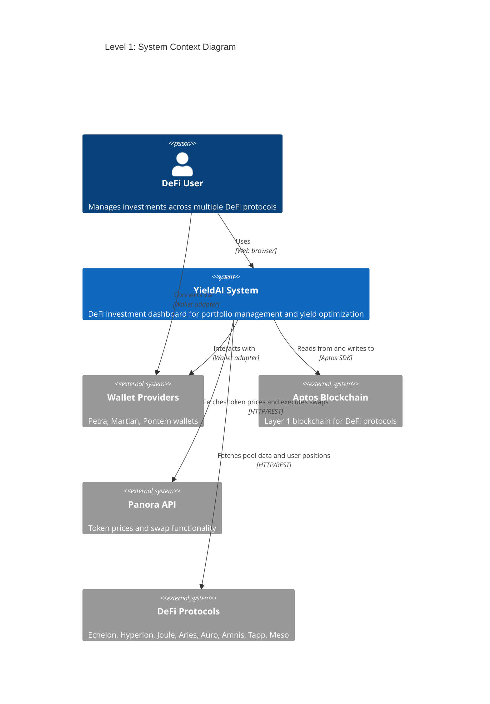

# C4 Context Diagram - YieldAI System

## System Context

This diagram shows how the YieldAI system fits into the larger environment, including users and external systems.

## Key External Systems

### Users
- **DeFi User**: Manages investments across multiple DeFi protocols

### External Systems
- **Aptos Blockchain**: Layer 1 blockchain providing the foundation for all DeFi protocols
- **Panora API**: Token prices, market data, and swap functionality
- **DeFi Protocols**: Multiple DeFi protocols (Echelon, Hyperion, Joule, Aries, Auro, Amnis, Tapp, Meso)
- **Wallet Providers**: Various Aptos wallet implementations (Petra, Martian, Pontem, etc.)

## System Responsibilities

The YieldAI system allows users to:
- View and manage portfolio across multiple DeFi protocols
- Discover investment opportunities with highest APY
- Execute deposits, withdrawals, and swaps
- Monitor positions and claim rewards
- Get AI-powered assistance for DeFi operations 