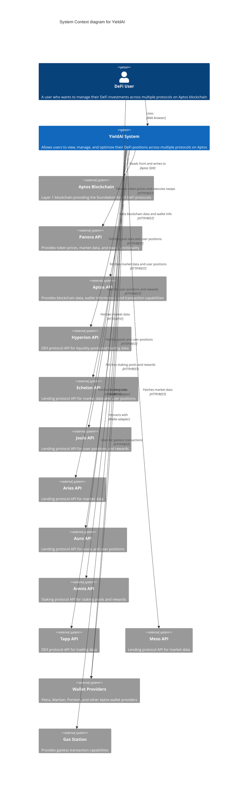

# C4 Context Diagram - YieldAI System

## System Context

This diagram shows how the YieldAI system fits into the larger environment, including users, external systems, and blockchain components.

## Key External Systems

### Blockchain Infrastructure
- **Aptos Blockchain**: The foundation layer providing transaction processing and smart contract execution
- **Wallet Providers**: Various Aptos wallet implementations (Petra, Martian, Pontem, etc.)
- **Gas Station**: Service for gasless transaction capabilities

### DeFi Protocols
- **Lending Protocols**: Echelon, Joule, Aries, Auro, Meso
- **DEX Protocols**: Hyperion, Tapp Exchange
- **Staking Protocols**: Amnis Finance

### Data & Trading Services
- **Panora API**: Token prices, market data, and swap functionality
- **Aptos API**: Blockchain data and wallet information

## User Interactions

The DeFi user interacts with the YieldAI system to:
1. Connect their wallet
2. View portfolio across multiple protocols
3. Discover investment opportunities
4. Execute deposits, withdrawals, and swaps
5. Manage positions and claim rewards
6. Monitor APY and performance metrics

## System Responsibilities

The YieldAI system acts as a unified interface that:
- Aggregates data from multiple DeFi protocols
- Provides a consistent user experience across different protocols
- Enables cross-protocol portfolio management
- Offers investment discovery and comparison tools
- Handles wallet connections and transaction signing
- Provides real-time market data and APY calculations 