# C4 Component Diagram - Protocol Service

## Protocol Service Component Architecture

This diagram shows the internal structure of the Protocol Service container, detailing how it manages integrations with multiple DeFi protocols.

```mermaid
graph LR

  subgraph Protocol Service
    subgraph Core Management
      PR[📋 Protocol Registry<br/>TypeScript Class]
      BP[🔧 Base Protocol<br/>TypeScript Interface]
    end

    subgraph Protocol Implementations
      EP[⚡ Echelon<br/>TypeScript Class]
      HP[🌊 Hyperion<br/>TypeScript Class]
      JP[⚡ Joule<br/>TypeScript Class]
      AP[🟡 Auro<br/>TypeScript Class]
      AMP[🔵 Amnis<br/>TypeScript Class]
      ARP[🦁 Aries<br/>TypeScript Class]
      TP[🔘 Tapp<br/>TypeScript Class]
      MP[🟣 Meso<br/>TypeScript Class]
    end

    subgraph Data Processing
      DP[📊 Data Processor<br/>TypeScript Class]
      AC[📈 APY Calculator<br/>TypeScript Class]
    end

    subgraph External Integration
      TS[🔨 Transaction Submitter<br/>TypeScript Class]
    end
  end

  subgraph External Systems
    subgraph DeFi APIs
      EAPI[🏛️ Echelon API]
      HAPI[🌊 Hyperion API]
      JAPI[⚡ Joule API]
      AAPI[🟡 Auro API]
      AMAPI[🔵 Amnis API]
      ARAPI[🦁 Aries API]
      TAPI[🔘 Tapp API]
      MAPI[🟣 Meso API]
    end

    subgraph Services
      PSVC[💼 Portfolio Service]
      TSVC[🔨 Transaction Service]
    end
  end

  %% Protocol Registry relationships
  PR -->|Registers| EP
  PR -->|Registers| HP
  PR -->|Registers| JP
  PR -->|Registers| AP
  PR -->|Registers| AMP
  PR -->|Registers| ARP
  PR -->|Registers| TP
  PR -->|Registers| MP

  %% Protocol implementations inherit from Base Protocol
  EP -.->|Implements| BP
  HP -.->|Implements| BP
  JP -.->|Implements| BP
  AP -.->|Implements| BP
  AMP -.->|Implements| BP
  ARP -.->|Implements| BP
  TP -.->|Implements| BP
  MP -.->|Implements| BP

  %% Protocol to External APIs
  EP -->|Fetches market data| EAPI
  HP -->|Fetches pool data| HAPI
  JP -->|Fetches user positions| JAPI
  AP -->|Fetches lending data| AAPI
  AMP -->|Fetches staking data| AMAPI
  ARP -->|Fetches market info| ARAPI
  TP -->|Fetches trading data| TAPI
  MP -->|Fetches market data| MAPI

  %% Data processing flow
  EP -->|Sends raw data| DP
  HP -->|Sends raw data| DP
  JP -->|Sends raw data| DP
  AP -->|Sends raw data| DP
  AMP -->|Sends raw data| DP
  ARP -->|Sends raw data| DP
  TP -->|Sends raw data| DP
  MP -->|Sends raw data| DP

  %% Data processing and calculations
  DP -->|Sends standardized data| AC
  AC -->|Provides APY data| PSVC

  %% Transaction integration
  EP -->|Requests transaction building| TS
  HP -->|Requests transaction building| TS
  JP -->|Requests transaction building| TS
  AP -->|Requests transaction building| TS
  AMP -->|Requests transaction building| TS
  ARP -->|Requests transaction building| TS
  TP -->|Requests transaction building| TS
  MP -->|Requests transaction building| TS

  %% Service relationships
  TS -->|Uses for transactions| TSVC

  classDef component fill:#1168BD,stroke:#0E5DAD,stroke-width:2px,color:#fff
  classDef external fill:#999999,stroke:#8A8A8A,stroke-width:2px,color:#fff
  classDef interface fill:#85BBF0,stroke:#6BA5E7,stroke-width:2px,color:#000

  class PR,EP,HP,JP,AP,AMP,ARP,TP,MP,DP,AC,TS component
  class EAPI,HAPI,JAPI,AAPI,AMAPI,ARAPI,TAPI,MAPI,PSVC,TSVC external
  class BP interface
```

## Component Details

### Core Management Components

#### Protocol Registry
- **Technology**: TypeScript Class
- **Responsibilities**:
  - Central registration of all DeFi protocols
  - Protocol discovery and initialization
  - Configuration management
  - Protocol lifecycle management

#### Base Protocol
- **Technology**: TypeScript Interface
- **Responsibilities**:
  - Common interface for all protocols
  - Standardized method signatures
  - Base implementation for common functionality
  - Protocol abstraction layer

### Individual Protocol Implementations

#### Echelon Protocol
- **Technology**: TypeScript Class
- **Responsibilities**:
  - Integration with Echelon lending markets
  - Market data fetching and transformation
  - User position management
  - Deposit/withdrawal operations

#### Hyperion Protocol
- **Technology**: TypeScript Class
- **Responsibilities**:
  - Integration with Hyperion DEX
  - Liquidity pool data management
  - Trading position tracking
  - Swap functionality

#### Joule Protocol
- **Technology**: TypeScript Class
- **Responsibilities**:
  - Integration with Joule lending protocol
  - Lending pool management
  - User position tracking
  - Reward claiming

#### Auro Protocol
- **Technology**: TypeScript Class
- **Responsibilities**:
  - Integration with Auro lending markets
  - Collateral management
  - USDA borrowing operations
  - Position monitoring

#### Amnis Protocol
- **Technology**: TypeScript Class
- **Responsibilities**:
  - Integration with Amnis staking protocol
  - Staking pool management
  - Reward calculation
  - Liquid staking operations

#### Aries Protocol
- **Technology**: TypeScript Class
- **Responsibilities**:
  - Integration with Aries lending markets
  - Market data aggregation
  - Position tracking
  - External deposit management

#### Tapp Protocol
- **Technology**: TypeScript Class
- **Responsibilities**:
  - Integration with Tapp DEX
  - Trading pool management
  - Position tracking
  - Modular trading operations

#### Meso Protocol
- **Technology**: TypeScript Class
- **Responsibilities**:
  - Integration with Meso lending protocol
  - Market data management
  - Position tracking
  - Capital efficiency features

### Data Processing Components

#### Data Processor
- **Technology**: TypeScript Class
- **Responsibilities**:
  - Raw data transformation
  - Standardization of protocol responses
  - Data validation and error handling
  - Format conversion for UI consumption

#### APY Calculator
- **Technology**: TypeScript Class
- **Responsibilities**:
  - APY calculation across protocols
  - Yield comparison algorithms
  - Real-time rate updates
  - Performance metrics calculation

### External Integration

#### Transaction Submitter
- **Technology**: TypeScript Class
- **Responsibilities**:
  - Transaction payload creation
  - Gas estimation and optimization
  - Transaction submission and monitoring
  - Error handling and retry logic

## External Integrations

### DeFi Protocol APIs
Each protocol implementation connects to its respective external API:
- **Echelon API**: Lending market data and user positions
- **Hyperion API**: DEX pool data and trading information
- **Joule API**: Lending pools and user positions
- **Auro API**: Lending markets and collateral data
- **Amnis API**: Staking pools and rewards data
- **Aries API**: Lending market information
- **Tapp API**: DEX trading data and pools
- **Meso API**: Lending market data

### Internal Service Integrations

#### Portfolio Service
- **Purpose**: Portfolio data aggregation
- **Integration**: Receives standardized protocol data and APY calculations

#### Transaction Service
- **Purpose**: Transaction building and submission
- **Integration**: All protocols request transaction building for user operations

## Key Interactions

1. **Protocol Registration**: Protocol Registry → Individual Protocols
2. **Data Fetching**: Individual Protocols → External APIs
3. **Data Processing**: Individual Protocols → Data Processor → APY Calculator
4. **Portfolio Integration**: APY Calculator → Portfolio Service
5. **Transaction Building**: Individual Protocols → Transaction Service

## Design Patterns

- **Registry Pattern**: Centralized protocol management
- **Strategy Pattern**: Different protocol implementations
- **Adapter Pattern**: Standardizing external API responses
- **Factory Pattern**: Protocol instantiation and configuration 