# C4 Component Diagram - Wallet Service

## Wallet Service Component Architecture

This diagram shows the internal structure of the Wallet Service container, detailing how it manages wallet connections, blockchain interactions, and gasless transactions.

```mermaid
graph TD

  subgraph Wallet Service
    WC[🔗 Wallet Connect<br/>TypeScript Class<br/>Manages wallet connection and authentication]
    
    WA[🔌 Wallet Adapter<br/>TypeScript Class<br/>Multi-wallet support and abstraction layer]
    
    AW[👛 Aptos Wallet<br/>TypeScript Class<br/>Core Aptos blockchain integration]
    
    GS[⛽ Gas Station<br/>TypeScript Class<br/>Gasless transaction capabilities]
    
    AB[💰 Apt Balance Service<br/>TypeScript Class<br/>Checks user APT balance for gas decisions]
    
    TS[🔨 Transaction Submitter<br/>TypeScript Hook<br/>Unified transaction submission logic]
    
    WP[⚙️ Wallet Provider<br/>React Context<br/>Global wallet state management]
    
    WS[🔍 Wallet Selector<br/>React Component<br/>Multi-wallet selection interface]
  end

  subgraph External Systems
    ABLOCK[🔗 Aptos Blockchain<br/>External System<br/>Layer 1 blockchain for transactions]
    
    PETRA[👛 Petra Wallet<br/>External Wallet<br/>Aptos wallet implementation]
    
    MARTIAN[🪐 Martian Wallet<br/>External Wallet<br/>Aptos wallet implementation]
    
    PONTEM[🌊 Pontem Wallet<br/>External Wallet<br/>Aptos wallet implementation]
    
    GASAPI[⛽ Gas Station API<br/>External API<br/>Gasless transaction service]
    
    TSERVICE[🔨 Transaction Service<br/>Internal Service<br/>Transaction building and payload creation]
    
    PSERVICE[💼 Portfolio Service<br/>Internal Service<br/>Portfolio data and balance queries]
  end

  %% Wallet connection flow
  WC -->|Manages connections| WA
  WA -->|Supports| PETRA
  WA -->|Supports| MARTIAN
  WA -->|Supports| PONTEM

  %% Aptos integration
  AW -->|Reads from and writes to| ABLOCK
  WA -->|Uses| AW

  %% Gas station integration
  GS -->|API calls| GASAPI
  GS -->|Provides gasless transactions| TS

  %% Balance checking
  AB -->|Queries| ABLOCK
  AB -->|Provides balance info| TS

  %% Transaction submission
  TS -->|Submits transactions| ABLOCK
  TS -->|Uses for gasless| GS
  TS -->|Uses for regular| WA

  %% State management
  WP -->|Manages global state| WA
  WP -->|Provides context| WS

  %% Service integrations
  TS -->|Requests transaction building| TSERVICE
  AB -->|Provides balance data| PSERVICE

  classDef component fill:#1168BD,stroke:#0E5DAD,stroke-width:2px,color:#fff
  classDef external fill:#999999,stroke:#8A8A8A,stroke-width:2px,color:#fff
  classDef hook fill:#85BBF0,stroke:#6BA5E7,stroke-width:2px,color:#000
  classDef context fill:#B8D4F0,stroke:#A5C7E8,stroke-width:2px,color:#000

  class WC,WA,AW,GS,AB component
  class ABLOCK,PETRA,MARTIAN,PONTEM,GASAPI,TSERVICE,PSERVICE external
  class TS hook
  class WP,WS context
```



## Component Details

### Core Wallet Management Components

#### Wallet Connect
- **Technology**: TypeScript Class
- **Responsibilities**:
  - Wallet connection management
  - Authentication and authorization
  - Connection state tracking
  - Error handling for connection issues

#### Wallet Adapter
- **Technology**: TypeScript Class
- **Responsibilities**:
  - Multi-wallet abstraction layer
  - Wallet provider management
  - Standardized wallet interface
  - Cross-wallet compatibility

#### Aptos Wallet
- **Technology**: TypeScript Class
- **Responsibilities**:
  - Core Aptos blockchain integration
  - Transaction signing and submission
  - Account balance retrieval
  - Network configuration management

### Gas Station Integration

#### Gas Station
- **Technology**: TypeScript Class
- **Responsibilities**:
  - Gas Station API integration
  - Gasless transaction configuration
  - Fee payer management
  - Transaction sponsorship

#### Apt Balance Service
- **Technology**: TypeScript Class
- **Responsibilities**:
  - APT balance checking
  - Gas fee estimation
  - Balance monitoring
  - Decision logic for gas vs gasless transactions

### Transaction Management

#### Transaction Submitter
- **Technology**: React Hook
- **Responsibilities**:
  - Unified transaction submission
  - Automatic gas vs gasless selection
  - Transaction payload validation
  - Error handling and retry logic

### State Management

#### Wallet Provider
- **Technology**: React Context
- **Responsibilities**:
  - Global wallet state management
  - Connection state persistence
  - Wallet configuration
  - Cross-component state sharing

#### Wallet Selector
- **Technology**: React Component
- **Responsibilities**:
  - Multi-wallet selection interface
  - Wallet connection UI
  - Connection status display
  - Wallet switching functionality

## External Integrations

### Blockchain Integration
- **Aptos Blockchain**: Direct blockchain interaction for transactions and data
- **Gas Station API**: External service for gasless transaction capabilities

### Wallet Providers
- **Petra Wallet**: Primary Aptos wallet implementation
- **Martian Wallet**: Alternative Aptos wallet
- **Pontem Wallet**: Additional wallet option

### Internal Service Integrations

#### Transaction Service
- **Purpose**: Transaction building and payload creation
- **Integration**: Receives transaction requests and builds payloads

#### Portfolio Service
- **Purpose**: Portfolio data and balance queries
- **Integration**: Provides balance information for gas decisions

## Key Interactions

1. **Wallet Connection**: Wallet Connect → Wallet Adapter → External Wallets
2. **Balance Checking**: Apt Balance Service → Aptos Blockchain
3. **Transaction Decision**: Transaction Submitter → Apt Balance Service → Gas Station/Regular Wallet
4. **Gasless Transactions**: Transaction Submitter → Gas Station → Gas Station API
5. **Regular Transactions**: Transaction Submitter → Wallet Adapter → Aptos Blockchain
6. **State Management**: Wallet Provider → All Components

## Transaction Flow Logic

### Gas Decision Algorithm
```
1. Check APT balance via Apt Balance Service
2. If APT > 0:
   - Use regular transaction via Wallet Adapter
   - User pays gas fees
3. If APT = 0:
   - Use Gas Station with withFeePayer: true
   - Gas Station sponsors the transaction
4. Submit transaction to Aptos Blockchain
5. Handle response and errors
```

### Gas Station Configuration
- **Network**: Aptos Mainnet
- **API Key**: From environment variables
- **Gas Limit**: 20,000 (Gas Station limit)
- **Fee Payer**: Enabled for gasless transactions

## Error Handling

- **Wallet Connection Failures**: Retry logic and user feedback
- **Gas Station Unavailable**: Fallback to regular transactions
- **Insufficient Balance**: Clear error messages and guidance
- **Transaction Failures**: Detailed error reporting and retry options

## Security Considerations

- **Private Key Management**: Never stored in application
- **API Key Security**: Environment variable protection
- **Transaction Validation**: Payload validation before submission
- **Error Information**: Sanitized error messages for users 