# C4 Component Diagram - Web Application

## Web Application Component Architecture

This diagram shows the internal structure of the Web Application container, detailing UI components, pages, and their interactions.

```mermaid
graph TD

  subgraph Web Application
    %% Main Pages
    MP[📄 Main Page<br/>Next.js Page<br/>Application entry point and layout]
    
    DP[📊 Dashboard Page<br/>Next.js Page<br/>Main investment dashboard interface]
    
    PP[💼 Portfolio Page<br/>Next.js Page<br/>Detailed portfolio view and management]
    
    PROTP[🏛️ Protocols Page<br/>Next.js Page<br/>Protocol discovery and comparison]
    
    SP[📈 Strategy Page<br/>Next.js Page<br/>Strategy management and creation]
    
    %% Core Components
    ID[💼 Investments Dashboard<br/>React Component<br/>Main investment interface with drag & drop]
    
    PC[💳 Portfolio Card<br/>React Component<br/>Portfolio overview display]
    
    PL[📋 Protocol List<br/>React Component<br/>List of available protocols]
    
    SB[🔧 Strategy Builder<br/>React Component<br/>Visual strategy creation interface]
    
    CP[💬 Chat Panel<br/>React Component<br/>AI assistant interface]
    
    %% Navigation Components
    SID[🧭 Sidebar<br/>React Component<br/>Navigation and protocol selection]
    
    MT[📱 Mobile Tabs<br/>React Component<br/>Mobile navigation interface]
    
    WS[🔍 Wallet Selector<br/>React Component<br/>Multi-wallet selection interface]
    
    WC[🔗 Wallet Connect<br/>React Component<br/>Wallet connection management]
    
    %% Portfolio Components
    TL[📋 Token List<br/>React Component<br/>Token balance display]
    
    TI[🪙 Token Item<br/>React Component<br/>Individual token display]
    
    POS[📈 Positions List<br/>React Component<br/>User positions across protocols]
    
    PI[📊 Position Item<br/>React Component<br/>Individual position display]
    
    %% Protocol Components
    PROTC[🏛️ Protocol Cards<br/>React Components<br/>Protocol-specific UI components]
    
    MPOS[📈 Manage Positions<br/>React Component<br/>Position management interface]
    
    %% Transaction Components
    DM[💰 Deposit Modal<br/>React Component<br/>Deposit transaction interface]
    
    WM[💸 Withdraw Modal<br/>React Component<br/>Withdrawal transaction interface]
    
    SM[🔄 Swap Modal<br/>React Component<br/>Token swap interface]
    
    STM[📊 Strategy Modal<br/>React Component<br/>Strategy configuration interface]
    
    %% UI Library Components
    UIC[🎨 UI Components<br/>shadcn/ui Library<br/>Reusable UI components]
    
    %% State Management
    WPC[👛 Wallet Provider<br/>React Context<br/>Global wallet state management]
    
    PPC[🏛️ Protocol Provider<br/>React Context<br/>Protocol state management]
    
    DDC[🖱️ Drag Drop Context<br/>React Context<br/>Drag & drop state management]
    
    CC[📁 Collapsible Context<br/>React Context<br/>UI collapse state management]
  end

  subgraph External Systems
    AG[🚪 API Gateway<br/>Internal Service<br/>Backend API endpoints]
    
    WSVC[👛 Wallet Service<br/>Internal Service<br/>Wallet management and blockchain interactions]
    
    PSVC[🏛️ Protocol Service<br/>Internal Service<br/>DeFi protocol integrations]
    
    PFSVC[💼 Portfolio Service<br/>Internal Service<br/>Portfolio data management]
    
    SSVC[💱 Swap Service<br/>Internal Service<br/>Token swap functionality]
    
    TSVC[🔨 Transaction Service<br/>Internal Service<br/>Transaction management]
    
    STSVC[📊 Strategy Service<br/>Internal Service<br/>Strategy management]
    
    CSVC[🤖 AI Chat Service<br/>Internal Service<br/>AI assistance]
  end

  %% Page Navigation Flow
  MP -->|Renders| DP
  MP -->|Renders| PP
  MP -->|Renders| PROTP
  MP -->|Renders| SP

  %% Layout Components
  MP -->|Renders| SID
  MP -->|Renders| MT
  MP -->|Renders| WS
  MP -->|Renders| WC

  %% Dashboard Components
  DP -->|Renders| ID
  DP -->|Renders| CP
  ID -->|Uses| PC
  ID -->|Uses| PL

  %% Portfolio Components
  PP -->|Renders| PC
  PC -->|Uses| TL
  TL -->|Uses| TI
  PP -->|Renders| POS
  POS -->|Uses| PI

  %% Protocol Components
  PROTP -->|Renders| PL
  PL -->|Uses| PROTC
  PROTC -->|Uses| MPOS

  %% Strategy Components
  SP -->|Renders| SB
  SB -->|Uses| STM

  %% Transaction Modals
  PROTC -->|Uses| DM
  PROTC -->|Uses| WM
  PROTC -->|Uses| SM

  %% UI Components Usage
  MP -->|Uses| UIC
  DP -->|Uses| UIC
  PP -->|Uses| UIC
  PROTP -->|Uses| UIC
  SP -->|Uses| UIC

  %% State Management
  MP -->|Uses| WPC
  MP -->|Uses| PPC
  MP -->|Uses| DDC
  MP -->|Uses| CC

  %% API Interactions
  ID -->|Makes API calls to| AG
  PC -->|Makes API calls to| AG
  PL -->|Makes API calls to| AG
  SB -->|Makes API calls to| AG
  CP -->|Makes API calls to| AG

  %% Service-specific interactions
  WC -->|Connects to| WSVC
  PC -->|Gets portfolio data from| PFSVC
  PL -->|Gets protocol data from| PSVC
  SM -->|Executes swaps via| SSVC
  DM -->|Creates transactions via| TSVC
  WM -->|Creates transactions via| TSVC
  SB -->|Manages strategies via| STSVC
  CP -->|Gets AI assistance from| CSVC

  classDef page fill:#1168BD,stroke:#0E5DAD,stroke-width:2px,color:#fff
  classDef component fill:#438DD5,stroke:#3B7BC0,stroke-width:2px,color:#fff
  classDef modal fill:#85BBF0,stroke:#6BA5E7,stroke-width:2px,color:#000
  classDef context fill:#B8D4F0,stroke:#A5C7E8,stroke-width:2px,color:#000
  classDef external fill:#999999,stroke:#8A8A8A,stroke-width:2px,color:#fff

  class MP,DP,PP,PROTP,SP page
  class ID,PC,PL,SB,CP,SID,MT,WS,WC,TL,TI,POS,PI,PROTC,MPOS,UIC component
  class DM,WM,SM,STM modal
  class WPC,PPC,DDC,CC context
  class AG,WSVC,PSVC,PFSVC,SSVC,TSVC,STSVC,CSVC external
```

## Component Details

### Main Pages

#### Main Page
- **Technology**: Next.js Page
- **Responsibilities**:
  - Application entry point
  - Layout management
  - Navigation structure
  - Global state initialization

#### Dashboard Page
- **Technology**: Next.js Page
- **Responsibilities**:
  - Main investment interface
  - Portfolio overview
  - Investment opportunities
  - Real-time data display

#### Portfolio Page
- **Technology**: Next.js Page
- **Responsibilities**:
  - Detailed portfolio view
  - Position management
  - Performance analytics
  - Asset allocation

#### Protocols Page
- **Technology**: Next.js Page
- **Responsibilities**:
  - Protocol discovery
  - APY comparison
  - Protocol filtering
  - Investment opportunities

#### Strategy Page
- **Technology**: Next.js Page
- **Responsibilities**:
  - Strategy management
  - Strategy creation
  - Performance tracking
  - Strategy templates

### Core Components

#### Investments Dashboard
- **Technology**: React Component
- **Responsibilities**:
  - Main investment interface
  - Drag & drop functionality
  - Real-time updates
  - Investment actions

#### Portfolio Card
- **Technology**: React Component
- **Responsibilities**:
  - Portfolio overview display
  - Total value calculation
  - Asset distribution
  - Quick actions

#### Protocol List
- **Technology**: React Component
- **Responsibilities**:
  - Protocol listing
  - APY display
  - Protocol filtering
  - Quick deposit actions

#### Strategy Builder
- **Technology**: React Component
- **Responsibilities**:
  - Visual strategy creation
  - Drag & drop interface
  - Strategy validation
  - Template selection

#### Chat Panel
- **Technology**: React Component
- **Responsibilities**:
  - AI assistant interface
  - Natural language input
  - Transaction execution
  - Context-aware responses

### Navigation Components

#### Sidebar
- **Technology**: React Component
- **Responsibilities**:
  - Navigation menu
  - Protocol selection
  - Quick actions
  - User preferences

#### Mobile Tabs
- **Technology**: React Component
- **Responsibilities**:
  - Mobile navigation
  - Touch-friendly interface
  - Responsive design
  - Quick access

#### Wallet Selector
- **Technology**: React Component
- **Responsibilities**:
  - Multi-wallet selection
  - Connection management
  - Wallet switching
  - Connection status

#### Wallet Connect
- **Technology**: React Component
- **Responsibilities**:
  - Wallet connection
  - Authentication
  - Connection state
  - Error handling

### Portfolio Components

#### Token List
- **Technology**: React Component
- **Responsibilities**:
  - Token balance display
  - Token filtering
  - Value calculations
  - Token actions

#### Token Item
- **Technology**: React Component
- **Responsibilities**:
  - Individual token display
  - Token logo and info
  - Balance and value
  - Quick actions

#### Positions List
- **Technology**: React Component
- **Responsibilities**:
  - User positions display
  - Protocol grouping
  - Performance metrics
  - Position actions

#### Position Item
- **Technology**: React Component
- **Responsibilities**:
  - Individual position display
  - APY and earnings
  - Position status
  - Management actions

### Protocol Components

#### Protocol Cards
- **Technology**: React Components
- **Responsibilities**:
  - Protocol-specific UI
  - Pool information
  - APY display
  - Deposit/withdraw actions

#### Manage Positions
- **Technology**: React Component
- **Responsibilities**:
  - Position management
  - Deposit/withdraw
  - Claim rewards
  - Position monitoring

### Transaction Components

#### Deposit Modal
- **Technology**: React Component
- **Responsibilities**:
  - Deposit interface
  - Amount input
  - Transaction confirmation
  - Status tracking

#### Withdraw Modal
- **Technology**: React Component
- **Responsibilities**:
  - Withdrawal interface
  - Amount selection
  - Transaction confirmation
  - Status tracking

#### Swap Modal
- **Technology**: React Component
- **Responsibilities**:
  - Token swap interface
  - Price quotes
  - Slippage settings
  - Transaction execution

#### Strategy Modal
- **Technology**: React Component
- **Responsibilities**:
  - Strategy configuration
  - Parameter settings
  - Risk assessment
  - Strategy activation

### State Management

#### Wallet Provider
- **Technology**: React Context
- **Responsibilities**:
  - Global wallet state
  - Connection management
  - Account information
  - Cross-component sharing

#### Protocol Provider
- **Technology**: React Context
- **Responsibilities**:
  - Protocol state management
  - Data caching
  - Real-time updates
  - Protocol selection

#### Drag Drop Context
- **Technology**: React Context
- **Responsibilities**:
  - Drag & drop state
  - Item tracking
  - Drop zones
  - Visual feedback

#### Collapsible Context
- **Technology**: React Context
- **Responsibilities**:
  - UI collapse state
  - Section management
  - User preferences
  - Responsive behavior

## Key Interactions

1. **Page Navigation**: Main Page → Other Pages
2. **Component Rendering**: Pages → Components
3. **State Management**: Components → Contexts
4. **API Communication**: Components → API Gateway
5. **Service Integration**: Components → Specific Services
6. **Modal Interactions**: Components → Transaction Modals

## UI/UX Patterns

- **Responsive Design**: Mobile-first approach with adaptive layouts
- **Drag & Drop**: Intuitive investment management
- **Real-time Updates**: Live data synchronization
- **Progressive Disclosure**: Information revealed as needed
- **Consistent Design**: shadcn/ui component library
- **Accessibility**: WCAG compliant components 