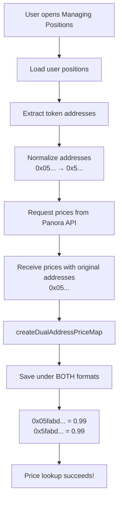

# Price Lookup Fix: Address Normalization Issue

## Problem Description

### Issue
When loading token prices in Echelon Managing Positions (and other protocol components), some tokens were showing `$0` price even though they had valid prices in the Panora API.

### Root Cause
**Address format mismatch** between:
- **Requested addresses**: Normalized without leading zeros (e.g., `0x5fabd1b...`)
- **API response addresses**: Original format with leading zeros (e.g., `0x05fabd1b...`)

### Example
Token USD1 (World Liberty Financial USD):
```json
{
  "faAddress": "0x05fabd1b12e39967a3c24e91b7b8f67719a6dacee74f3c8b9fb7d93e855437d2",
  "symbol": "USD1",
  "usdPrice": "0.99950998"
}
```

When system requests price for normalized address `0x5fabd1b...`, it cannot find it because the price map only contains `0x05fabd1b...`.

## Solution

### 1. Created Address Normalization Utility
**File**: `src/lib/utils/addressNormalization.ts`

Functions:
- `normalizeAddress(addr)` - Remove leading zeros from address
- `createDualAddressPriceMap(prices)` - Save prices under BOTH address formats
- `areAddressesEqual(addr1, addr2)` - Compare addresses after normalization
- `findTokenByAddress(tokens, searchAddr)` - Find token matching either format

### 2. Updated Price Fetching Logic

#### EchelonPositions Component
**Before**:
```typescript
response.data.forEach((price: TokenPrice) => {
  if (price.faAddress) {
    prices[price.faAddress] = price.usdPrice;
  }
});
```

**After**:
```typescript
const prices = createDualAddressPriceMap(response.data);
```

This ensures prices are saved under:
- `0x05fabd1b...` (original)
- `0x5fabd1b...` (normalized)

#### Updated Components:
1. ✅ `src/components/protocols/manage-positions/protocols/EchelonPositions.tsx`
2. ✅ `src/lib/stores/auroStore.ts`
3. ✅ `src/lib/stores/hyperionStore.ts`

### 3. Created Test Page
**File**: `src/app/test-panora-prices/page.tsx`

Features:
- Test Panora API with any token address
- Shows both normalized and original addresses
- Displays API response for debugging
- Explains the address normalization problem

Access at: `/test-panora-prices`

## How It Works

### Price Loading Flow (Echelon Example)



### When Refresh Positions is Clicked

1. **ManagePositions** component calls API
2. **refreshPositions** event is dispatched with new position data
3. **EchelonPositions** receives event and updates positions
4. **Price fetching useEffect** triggers (depends on `positions`)
5. **getAllTokenAddresses()** collects all token addresses
6. **Debounced fetch** (1 second delay) requests prices
7. **createDualAddressPriceMap** saves prices under both formats
8. **UI updates** with correct prices

## Testing

### Test the Fix
1. Navigate to `/test-panora-prices`
2. Enter token address: `0x5fabd1b12e39967a3c24e91b7b8f67719a6dacee74f3c8b9fb7d93e855437d2`
3. Click "Test Panora API"
4. Verify price is found for both address formats

### Verify in Managing Positions
1. Open Echelon Managing Positions
2. Check that USD1 token shows correct price (~$0.99)
3. Click "Refresh Positions"
4. Verify prices reload correctly

## Optimization Details

### Caching
- Prices cached for **5 minutes** in `PanoraPricesService`
- Cache key includes normalized addresses
- Prevents excessive API calls

### Debouncing
- Position loading: **500ms** debounce
- Price fetching: **1000ms** debounce
- Prevents multiple rapid requests when state changes

## Files Modified

| File | Changes |
|------|---------|
| `src/lib/utils/addressNormalization.ts` | ✨ Created utility functions |
| `src/components/protocols/manage-positions/protocols/EchelonPositions.tsx` | 🔧 Use `createDualAddressPriceMap` |
| `src/lib/stores/auroStore.ts` | 🔧 Use `createDualAddressPriceMap` |
| `src/lib/stores/hyperionStore.ts` | 🔧 Use `findTokenByAddress` |
| `src/app/test-panora-prices/page.tsx` | ✨ Created test page |
| `src/components/TestNavigation.tsx` | ➕ Added test page to navigation |

## Best Practices for Future Development

### When fetching token prices:
```typescript
// ✅ DO: Use the utility function
import { createDualAddressPriceMap } from '@/lib/utils/addressNormalization';

const response = await pricesService.getPrices(1, addresses);
const prices = createDualAddressPriceMap(response.data);
```

```typescript
// ❌ DON'T: Save prices without normalization
const prices: Record<string, string> = {};
response.data.forEach(price => {
  prices[price.faAddress] = price.usdPrice;  // Only one format!
});
```

### When comparing addresses:
```typescript
// ✅ DO: Use the comparison utility
import { areAddressesEqual } from '@/lib/utils/addressNormalization';

if (areAddressesEqual(addr1, addr2)) {
  // They're the same!
}
```

```typescript
// ❌ DON'T: Direct comparison
if (addr1 === addr2) {  // Fails if one has leading zeros!
}
```

## Impact

### Before Fix
- ❌ Some tokens showed $0 price
- ❌ Total portfolio value incorrect
- ❌ Confusing UX

### After Fix
- ✅ All tokens show correct prices
- ✅ Accurate portfolio calculations
- ✅ Consistent price lookups across all protocols
- ✅ Reusable utility for future development

## Related Issues

- Applies to all Aptos addresses (0x prefix)
- Affects any component fetching prices from Panora API
- Important for protocols: Echelon, Auro, Hyperion, and others

## Notes

The Aptos blockchain uses hexadecimal addresses with `0x` prefix. Leading zeros in these addresses are sometimes normalized (removed) by different systems. This creates a mismatch where `0x05abc...` and `0x5abc...` refer to the same address but don't match in string comparison.

Our solution ensures compatibility by storing data under both formats, making lookups work regardless of which format is used.

